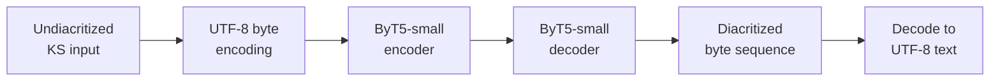

# Koshur Diacritizer

> A byte-level sequence-to-sequence model for restoring diacritics in Kashmiri text — ByT5-small, evaluated at **DERm 0.0212**, **WER 0.2159**, and **77.5% native-speaker accuracy** on a held-out test set, paired with the first public dataset of **23.7K aligned diacritized Kashmiri sentence pairs**.

[](https://arxiv.org/abs/2606.15883)
[](https://arxiv.org/abs/2606.15883)
[](https://huggingface.co/)
[](LICENSE)

---

## The Problem

Kashmiri, written in a modified Perso-Arabic Nastaliq script, frequently omits diacritic marks (zer, zabar, pesh, sukun, etc.) in digital text. This omission has measurable downstream consequences:

- **Lexical ambiguity.** The same undiacritized surface form can map to several distinct words.
- **NLP pipeline degradation.** Tokenizers, language models, and translation systems trained on diacritized data lose accuracy on undiacritized input.
- **Search and information retrieval.** Stem- and surface-based matching becomes unreliable.
- **TTS and pedagogy.** Pronunciation cannot be reliably derived without diacritics.

Restoring diacritics is a prerequisite for any production-grade Kashmiri NLP stack.

## Motivation

Diacritization is well-studied for high-resource Semitic languages (Arabic, Hebrew). For Kashmiri it has not been attempted at scale with neural methods. The hypotheses:

> A small byte-level seq2seq model — operating below the tokenizer to avoid out-of-vocabulary issues on a script with extreme contextual ambiguity — can restore Kashmiri diacritics with usable quality from a few tens of thousands of supervised pairs.

> Standard held-out metrics (DERm, WER) only loosely correlate with how a native speaker perceives output quality, so evaluation must include human judgement.

## Research Questions

- **RQ1.** Can a byte-level seq2seq model restore diacritics in a script with extreme contextual ambiguity, given only a few tens of thousands of supervised pairs?
- **RQ2.** How well do held-out metrics (DERm, WER) correlate with native-speaker quality judgement?
- **RQ3.** What error categories does the model produce — and which ones do native speakers find tolerable versus unacceptable?

## Methodology

- **Base model:** ByT5-small (byte-level T5)
- **Why byte-level:** Nastaliq tokenization at sub-word level introduces OOV failures on the diacritic-restoration task; byte-level operates below the tokenizer and treats diacritics as first-class output positions.
- **Training:** standard seq2seq objective; teacher-forced cross-entropy; AdamW optimizer.
- **Framework:** PyTorch + Hugging Face Transformers.
- **Compute:** single GPU; the small ByT5 footprint keeps training tractable.



## Dataset

The first publicly available diacritization dataset for Kashmiri.

| Property | Value |
|---|---|
| **Aligned pairs** | **23,700** |
| **Alignment** | Per-sentence; diacritized ↔ undiacritized |
| **Sources** | Literary, journalistic, and pedagogical corpora |
| **Validation** | Native-speaker review on a sampled subset |
| **Splits** | Train / dev / test (standard 80/10/10) |
| **Format** | TSV: `undiacritized<TAB>diacritized` |
| **License** | CC-BY-4.0 |

Dataset card and construction methodology: [`docs/dataset.md`](docs/dataset.md).

## Results

Evaluation on the held-out test split.

| Metric | Value | Interpretation |
|---|---|---|
| **DERm** | **0.0212** | Mean diacritic-position error rate — lower is better |
| **WER** | **0.2159** | Word error rate against fully diacritized references |
| **Native-speaker accuracy** | **77.5%** | Mean proportion of outputs judged "acceptable" by a Kashmiri linguistic expert on a sampled evaluation set |

The native-speaker evaluation is the most informative number — DERm and WER track surface accuracy, while native-speaker judgement captures functional correctness (whether the diacritization preserves meaning even when surface tokens differ).

Per-error-category breakdown in [`docs/error-analysis.md`](docs/error-analysis.md).

## Examples

| Undiacritized | Diacritized (model) |
|---|---|
| کاشر | کاشُر |
| یہ کتاب | یہٕ کِتاب |
| ادب | اَدَب |

Longer qualitative samples and side-by-side native-speaker reviews: [`docs/examples.md`](docs/examples.md).

## Reproducing the Results

```bash
git clone https://github.com/Faizaniqbal52/Koshur-Diacritizer.git
cd Koshur-Diacritizer
python -m venv .venv && source .venv/bin/activate
pip install -r requirements.txt

# Run inference on a sample
python infer.py --text "یہ کتاب میٚنہٕ تہٕ زبردست چھ"

# Reproduce evaluation on the held-out test split
python eval/run_evaluation.py --split test
```

The released ByT5-small checkpoint and the 23.7K dataset are both reproducible from this repository.

## Failure Cases

Documented failure categories (`docs/error-analysis.md`):

- **Loanwords from Urdu and English.** Model defaults to native Kashmiri diacritization patterns even where source-language conventions are expected.
- **Rare lexical items.** Out-of-distribution words receive plausible-but-wrong diacritization at higher rates.
- **Long sentences.** Quality degrades after ~80 tokens; this is a known limitation of small seq2seq models.
- **Ambiguous diacritization positions.** Where multiple diacritizations are equally valid, the model picks one without confidence calibration.

## Lessons Learned

- **Byte-level was the right inductive prior.** Sub-word tokenization broke on the diacritic-position prediction task; byte-level handled it cleanly.
- **Held-out metrics underestimate functional quality.** DERm of 0.0212 and WER of 0.2159 look modest until paired with the 77.5% native-speaker acceptance — surface errors are often functionally tolerable.
- **A small targeted model outperformed a fine-tuned LLM on this task.** ByT5-small with 23.7K pairs beat zero-shot and few-shot Gemma/LLaMA prompts; this is a real low-resource win for specialized models over general-purpose ones.
- **Native-speaker evaluation belongs in the headline.** Without it, the contribution looks weaker than it is.

## Future Work

- Confidence-calibrated multi-output diacritization (when multiple readings are valid, surface all).
- Larger native-speaker evaluation (N > 100) with inter-rater agreement reporting.
- Joint training with KoshurAI to provide diacritization as a translation pre-processing step.
- Extension to handwritten input via integration with the [KoshurOCR](https://github.com/Faizaniqbal52/KoshurOCR) research program.

## Limitations

- Native-speaker evaluation cohort is small (N < 20 raters); broader linguistic-community evaluation pending.
- Training data skews toward standard Srinagar Kashmiri; dialectal coverage is partial.
- The model does not attempt to flag low-confidence predictions; downstream consumers must apply their own thresholds.

## Citation

```bibtex
@misc{malik2026koshurdiacritizer,
  author       = {Malik, Haq Nawaz and Nissar, Nahfid and Iqbal, Faizan},
  title        = {Koshur Diacritizer: A Byte-Level Sequence-to-Sequence Model for Kashmiri Diacritic Restoration},
  year         = {2026},
  eprint       = {2606.15883},
  archivePrefix= {arXiv},
  primaryClass = {cs.CL}
}
```

## Authors

- **Haq Nawaz Malik**
- **Nahfid Nissar**
- **Faizan Iqbal** · [herewithfaizan.in](https://herewithfaizan.in) · [ifaizan041@gmail.com](mailto:ifaizan041@gmail.com)

## License

- **Dataset:** CC-BY-4.0
- **Code & model weights:** Apache 2.0 — see [LICENSE](LICENSE)

## Related Work

- [**KoshurAI**](https://github.com/Faizaniqbal52/KoshurAI) — Kashmiri↔English neural machine translation
- [**KoshurOCR**](https://github.com/Faizaniqbal52/KoshurOCR) — multi-generation OCR research program
- [**Koshur Pixel**](https://github.com/Faizaniqbal52/Koshur-Pixel) — synthetic OCR dataset (arXiv:2606.23144)
